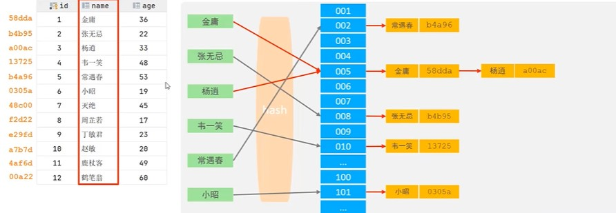

# 索引
· 索引概述
1. 介绍:(index)是帮助MySQL搞笑获取数据的数据结构(有序)。在数据之外,数据库系统还维护满足特定查找算法的数据结构,这些数据结构以某种方式引用(指向)数据。
2. 优缺点
            优势                                劣势
提高数据检索效率,降低数据库IO成本           索引列也是要占空间的
通过索引列对数据进行排序,降低数据排序的成    大大提高查找效率,同时也降低更新表的速度,
本,降低CPU的消耗。                         如对表进行INSERT\UPDATE\DELETE时,效率降低

· 索引结构
MySQL的索引是在存储引擎实现,不同的存储引擎有不同结构,主要包含一下几种:
索引结构        描述
B+TREE索引      最常见的索引,大部分引擎索引都支持B+树索引
HASH索引        底层数据结构是用哈希表实现的,只有精确到匹配索引列的数据才有效,不支持范围查询
R-TREE索引      空间索引是MyISAM引擎的一个特殊索引类型,主要用于地理空间数据类型,通常使用较少
FULL-TEXT索引   是一种通过建立倒排索引,快速匹配文档的方式。类似于Lucene/Solr/ES

索引类型        InnoDB                   MyISAM                MEMORY
B+TREE索引      支持                     支持                  支持
HASH索引        不支持                   不支持                支持
R-TREE索引      不支持                   支持                  不支持
FULL-TEXT索引   5.6以上支持              支持                  不支持
<!-- 平常所说索引如没有特别指明,默认为B+树索引 -->

## B+TREE索引
二叉树缺点:顺序插入时,会形成单链表,查询性能大大降低。大数据量情况下,层级较深,检索速度慢
红黑树: 大数据量情况下,层级较深,检索速度慢

B-TREE(多路平衡查找树)
以一颗最大度数(max-degree,指一个节点的子节点个数)为5(5阶)的b-tree树为例(每个节点最多存储4个key->五个指针)

`https://www.cs.usfca.edu/~galles/visualization/Algorithms.html # 数据结构可视化网站`

B+TREE
以一颗最大度数(max-degree)为4阶的b+tree树为例

和B-Tree的区别:
1) 所有数据都会出现在叶子节点
2) 叶子节点形成单向链表

MySQL索引对经典的B+Tree进行优化。在原B+Tree的基础上,增加一个指向相邻子节点的链表指针,就形成了带有顺序指针的B+Tree,提高区间访问的性能。

## HASH索引
哈希索引是采用一定的hash算法,将键值换算成新的hash值,映射到对应的槽位上,然后存储在hash表中。
如果两个(或多个)键值,映射到一个相同槽位时,产生hash冲突，可以通过链表来解决

特点:
1) Hash索引只能用于对等比较(=, in), 不支持查询范围(between, >, <, ...)
2) 无法利用索引完成排序操作
3) 查询效率高,通草只需要一次检索就可以,效率通常高于B+Tree索引
在MySQL中，支持hash索引的是Memory引擎，而InnoDB中具有自适应hash功能，hash索引是存储引擎根据B+Tree索引在指定条件下自动构建的
<!-- 思考: -->
<!-- 为什么InnoDB存储引擎选择使用B+TREE索引结构 -->
<!-- 相对于二叉树，层级更少，搜索效率更高 -->
<!-- 对于B-tree无论是叶子节点还是非叶子节点，都会保存数据，这导致一页中存储的键值减少，指针跟着减少，要童谣保持大量书籍，只能增加树的高度，导致性能降低 -->
<!-- 相对于Hash索引，B+tree支持范围匹配及排序操作 -->

· 索引分类
分类            含义                            特点                    关键字
主键索引    针对表中主键创建的索引              默认自动创建，只能有一个    PRIMARY
唯一索引    避免同一个表中某数据列中的值重复     可以有多个                 UNIQUE
常规索引    快速定位特定数据                    可以有多个
全文索引    全文索引查抄的是文本中的关键词，     可以有多个                 FULLTEXT
                而不是比较索引中的值

在InnoDB中，根据索引的存储形式又可以分为以下两种:
1) 聚簇索引(Clustered Index)
将数据存储与索引放到一块,索引结构的叶子节点保存了行数据
特点:必须有而且只有一个
<!-- 选取规则:
如果存在主键，则默认为聚簇索引；
如果不存在主键，则将使用为唯一索引(Uni1que)作为聚集索引；
如果表没有主键或没有合适的唯一索引，则InnoDB会自动生成一个rowid作为因此的聚集索引。 -->
2) 二级索引(Secondary Index)
将数据与索引分开存储，索引结构的叶子节点快练得是对应的主键
特点:可以存在多个

select * from user where name = 'Arm';
回表查询: 先从二级索引找到对应主键值，根据主键值到聚集索引找到对应行的行数据
<!-- 思考 -->
<!-- 以id为主键，name字段创建的有索引 -->
<!-- 1.select* from user where id = 10; 和 2.select * from user where name = 'Arm' -->
<!-- 哪一个执行效率高，为什么  -->

<!-- InnoDB主键索引的B+Tree 高度多高? -->
<!--  -->

· 索引语法
1. 创建索引
CREATE [UNIQUE|FULLTEXT] INDEX index_name ON table_name (index_column_name,...);
2. 查看索引
SHOW INDEX FROM table_name;
3. 删除索引
DROP INDEX index_name ON table_name;

· SQL性能分析
· 索引使用
· 索引设计原则